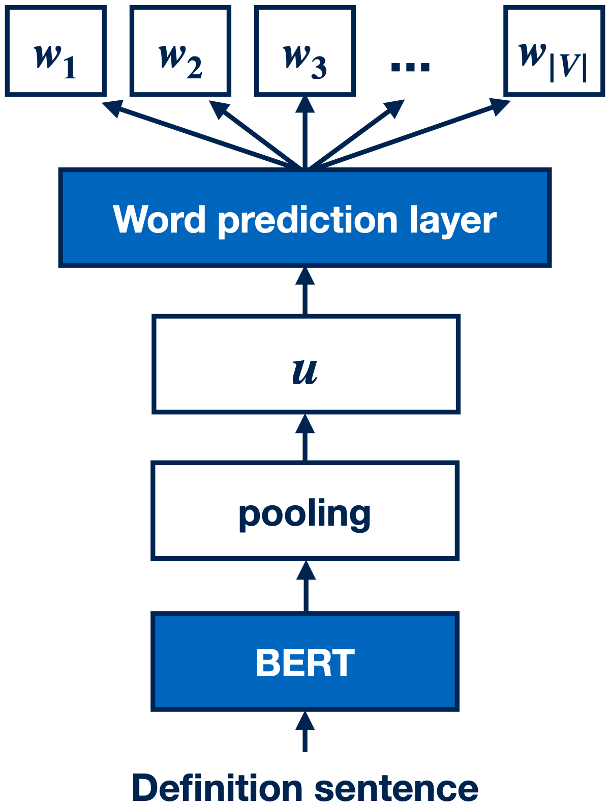

# DefSent: Sentence Embeddings using Definition Sentences

This repository contains the experimetns code, pre-trained models, and examples for our paper [DefSent: Sentence Embeddings using Definition Sentences](https://aclanthology.org/2021.acl-short.52/)

ACL Anthology: https://aclanthology.org/2021.acl-short.52/

## Overview

</img>

## Getting started

### Install from PyPI

```
pip install defsent
```

### Encode sentences into `torch.Tensor`


```python
from defsent import DefSent

model = DefSent("cl-nagoya/defsent-bert-base-uncased-cls")
embeddings = model.encode([
  "A woman is playing the guitar.",
  "A man is playing guitar.",
])
```

### Predict words from input sentences

```python
from defsent import DefSent

model = DefSent("cl-nagoya/defsent-bert-base-uncased-cls")
predicted_words = model.predict_words([
  "be expensive for (someone)",
  "an open-source operating system modelled on unix",
  "not bad",
])
```

Example reults for definition sentences.


Example reults for sentences other than definition sentences.


## Pretrained checkpoints

Search: https://huggingface.co/models?search=defsent

| checkpoint | STS12 | STS13 | STS14 | STS15 | STS16 | STS-B | SICK-R | Avg. |
|--|--|--|--|--|--|--|--|--|
|[defsent-bert-base-uncased-cls](https://huggingface.co/cl-nagoya/defsent-bert-base-uncased-cls)|67.61|80.44|70.12|77.5|76.34|75.25|71.71|74.14|
|[defsent-bert-base-uncased-mean](https://huggingface.co/cl-nagoya/defsent-bert-base-uncased-mean)|68.24|82.62|72.8|78.44|76.79|77.5|71.69|75.44|
|[defsent-bert-base-uncased-max](https://huggingface.co/cl-nagoya/defsent-bert-base-uncased-max)|65.32|82.00|73.00|77.38|75.84|76.74|71.67|74.57|
|[defsent-bert-large-uncased-cls](https://huggingface.co/cl-nagoya/defsent-bert-large-uncased-cls)|67.03|82.41|71.25|80.33|75.43|73.83|73.34|74.8|
|[defsent-bert-large-uncased-mean](https://huggingface.co/cl-nagoya/defsent-bert-large-uncased-mean)|63.93|82.43|73.29|80.52|77.84|78.41|73.39|75.69|
|[defsent-bert-large-uncased-max](https://huggingface.co/cl-nagoya/defsent-bert-large-uncased-max)|60.15|80.70|71.67|77.19|75.71|76.90|72.57|73.55|
|[defsent-roberta-base-cls](https://huggingface.co/cl-nagoya/defsent-roberta-base-cls)|66.13|80.96|72.59|78.33|78.85|78.51|74.44|75.69|
|[defsent-roberta-base-mean](https://huggingface.co/cl-nagoya/defsent-roberta-base-mean)|62.38|78.42|70.79|74.60|77.32|77.38|73.07|73.42|
|[defsent-roberta-base-max](https://huggingface.co/cl-nagoya/defsent-roberta-base-max)|64.61|78.76|70.24|76.07|79.02|78.34|74.54|74.51|
|[defsent-roberta-large-cls](https://huggingface.co/cl-nagoya/defsent-roberta-large-cls)|62.47|79.07|69.87|72.62|77.87|79.11|73.95|73.56|
|[defsent-roberta-large-mean](https://huggingface.co/cl-nagoya/defsent-roberta-large-mean)|57.8|72.98|69.18|72.84|76.50|79.17|74.36|71.83|
|[defsent-roberta-large-max](https://huggingface.co/cl-nagoya/defsent-roberta-large-max)|64.11|81.42|72.52|75.37|80.23|79.16|73.76|75.22|

### Hyperparameters for each checkpoint and fine-tuning task performance


## Citation

```bibtex
@inproceedings{tsukagoshi-etal-2021-defsent,
    title = "{D}ef{S}ent: Sentence Embeddings using Definition Sentences",
    author = "Tsukagoshi, Hayato  and
      Sasano, Ryohei  and
      Takeda, Koichi",
    booktitle = "Proceedings of the 59th Annual Meeting of the Association for Computational Linguistics and the 11th International Joint Conference on Natural Language Processing (Volume 2: Short Papers)",
    month = aug,
    year = "2021",
    address = "Online",
    publisher = "Association for Computational Linguistics",
    url = "https://aclanthology.org/2021.acl-short.52",
    doi = "10.18653/v1/2021.acl-short.52",
    pages = "411--418",
}
```